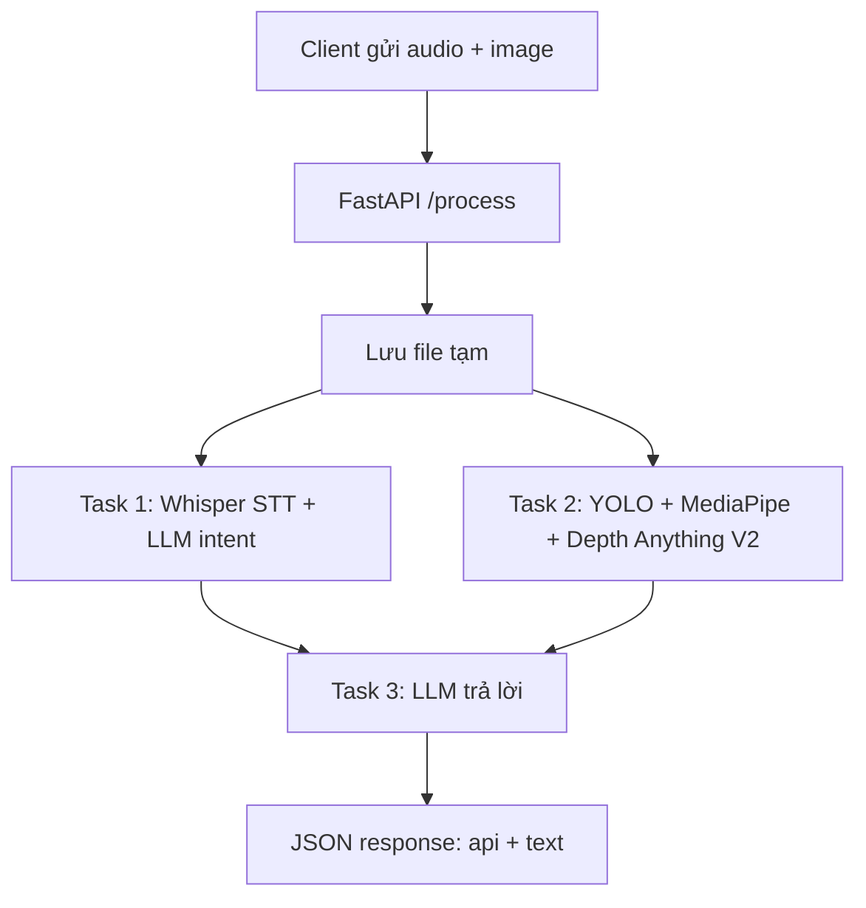

# STRUCTURE.md

## Tổng quan dự án

`assistant-for-the-blind` là backend FastAPI hỗ trợ người khiếm thị bằng giọng nói và thị giác máy tính. Client gửi `audio` và `image` đến API `/process`; server chạy song song hai nhánh xử lý:

1. STT + LLM để chuyển giọng nói thành văn bản và phân loại intent.
2. Vision pipeline để nhận diện vật thể, ước lượng độ sâu và tạo mô tả cảnh.

Sau đó hệ thống dùng LLM để viết câu trả lời tiếng Việt ngắn, tự nhiên, phù hợp với intent.

## Luồng xử lý chính



## API

- `GET /health`: kiểm tra server còn hoạt động, trả `{"status": "ok"}`.
- `POST /process`: nhận multipart form gồm `audio` và `image`.
  - Input: file âm thanh `.wav` hoặc định dạng tương đương, file ảnh `.jpg/.png`.
  - Output: JSON gồm:
    - `api`: intent đã chuẩn hóa, ví dụ `O_PHIA_TRUOC_CO_GI`, `TIM_DEN_LAY: cái ghế`.
    - `text`: câu trả lời tiếng Việt đã được làm mượt cho TTS.

## Cấu hình

- `server_config.json`: cấu hình trung tâm cho server, STT, TTS và vision.
- `app_config.py`: đọc `server_config.json`, nạp `.env`, thay các giá trị dạng `${ENV_VAR}` bằng biến môi trường.
- `.env.example`: mẫu biến môi trường, hiện dùng cho `GROQ_API_KEY`.
- `requirements.txt`: dependency Python của server chính.

## Cấu trúc thư mục

```text
.
├── .env.example
├── .gitignore
├── STRUCTURE.md
├── app_config.py
├── client_test.py
├── requirements.txt
├── server.py
├── server_config.json
├── prompt/
│   ├── __init__.py
│   └── prompts.py
├── service/
│   ├── __init__.py
│   ├── server.py
│   └── vision_pipeline.py
├── STT/
│   ├── __init__.py
│   ├── command_processor.py
│   ├── recorder.py
│   └── config/
│       ├── __init__.py
│       └── voice_config.py
├── TTS/
│   ├── __init__.py
│   ├── smoother.py
│   └── config/
│       ├── __init__.py
│       └── tts_config.py
├── vision/
│   ├── __init__.py
│   ├── depth_estimator.py
│   ├── hand_calibrator.py
│   ├── object_detector.py
│   ├── scene_builder.py
│   └── config/
│       ├── __init__.py
│       └── vision_config.py
└── models/
    ├── yolo11n.pt
    ├── checkpoints/
    │   ├── depth_anything_v2_metric_hypersim_vits.onnx
    │   └── depth_anything_v2_metric_hypersim_vits.pth
    └── Depth-Anything-V2/
        ├── app.py
        ├── run.py
        ├── run_video.py
        ├── requirements.txt
        ├── depth_anything_v2/
        └── metric_depth/
```

Ghi chú: các file runtime hoặc dữ liệu local như `.env`, `.venv/`, `.vs/`, `.vscode/`, `__pycache__/`, file âm thanh, ảnh test local, model weights/checkpoints và dataset lớn được đưa vào `.gitignore`.

## Module gốc

- `server.py`: entrypoint chạy Uvicorn, import FastAPI app từ `service.server`.
- `app_config.py`: config loader dùng chung cho mọi module.
- `client_test.py`: client mẫu; ghi âm nếu chưa có audio, gửi audio + ảnh mẫu đến `/process`.
- `testspeed.py`: script thử nghiệm cũ, hiện chứa API key hardcoded nên phải giữ ngoài git và nên thay bằng `.env` nếu còn dùng.

## `service/`

- `service/server.py`:
  - Khởi tạo FastAPI app.
  - Load model vision ở startup.
  - Endpoint `/process` lưu file tạm, chạy Task 1 và Task 2 bằng `asyncio.to_thread()` + `asyncio.gather()`.
  - Gọi `TTS.smoother.answer_from_api()` để tạo câu trả lời cuối.
  - Log latency từng task và xóa file tạm trong `finally`.
- `service/vision_pipeline.py`:
  - Load YOLO, Depth Anything V2, MediaPipe Hands.
  - Resize ảnh giữ tỉ lệ.
  - Detect vật thể, detect tay, tính focal length từ landmark bàn tay.
  - Infer depth, hiệu chỉnh depth theo khoảng cách tay chuẩn.
  - Lọc vật thể hợp lệ, tạo mô tả cảnh và chuỗi khoảng cách camera → vật thể.

## `STT/`

- `STT/command_processor.py`:
  - `transcribe_audio()`: gọi Whisper qua OpenAI-compatible Groq API.
  - `classify_command()`: gọi LLM để phân loại intent.
  - `parse_api_line()` và `normalize_api_output()`: chuẩn hóa output về API nội bộ.
  - `process_voice_command_api()`: hàm chính dùng bởi server, có thể trả latency từng bước.
- `STT/recorder.py`:
  - Ghi âm bằng `sounddevice`.
  - Cắt silence theo RMS và ghi file WAV.
- `STT/config/voice_config.py`:
  - Map cấu hình STT từ `server_config.json` sang constant Python.
  - Lấy prompt Whisper từ `prompt.prompts`.

## `TTS/`

- `TTS/smoother.py`:
  - Gọi LLM để viết lại mô tả thô thành câu tiếng Việt ngắn, phù hợp TTS.
  - Với `TIM_DEN_LAY`, trích khoảng cách ưu tiên của vật mục tiêu từ distance matrix.
  - Với `O_PHIA_TRUOC_CO_GI`, dùng mô tả cảnh thô để diễn giải tự nhiên.
- `TTS/config/tts_config.py`:
  - Map cấu hình LLM trả lời từ `server_config.json`.

## `vision/`

- `vision/object_detector.py`:
  - Load YOLO.
  - Detect object boxes.
  - Tính kích thước vật thể theo depth và focal length.
- `vision/hand_calibrator.py`:
  - Khởi tạo MediaPipe Hands.
  - Detect tay toàn ảnh, fallback sang crop vùng `person`.
  - Tính focal length dựa trên khoảng cách pixel giữa landmark 5 và 17.
- `vision/depth_estimator.py`:
  - Thiết lập import path cho Depth Anything V2.
  - Hỗ trợ inference bằng ONNX Runtime hoặc PyTorch checkpoint.
  - Hiệu chỉnh depth raw bằng khoảng cách tay đã biết.
- `vision/scene_builder.py`:
  - Lọc object theo confidence, depth range và độ ưu tiên.
  - Tính tọa độ 3D tương đối `X`, `Y`, `Z`.
  - Xây dựng chuỗi quan hệ ngang bằng doubly linked list.
  - Sinh quan hệ trên/dưới/phía sau và mô tả tiếng Việt thô.
- `vision/config/vision_config.py`:
  - Map cấu hình model, threshold, thiết bị, checkpoint path từ `server_config.json`.

## `prompt/`

- `prompt/prompts.py`:
  - Prompt Whisper cho ngữ cảnh lệnh tiếng Việt.
  - Prompt phân loại intent STT.
  - Prompt trả lời cho `O_PHIA_TRUOC_CO_GI`.
  - Prompt trả lời cho `TIM_DEN_LAY`.
  - `PROMPT_REGISTRY` để tra cứu prompt tập trung.

## `models/`

- `models/yolo11n.pt`: YOLO model weight.
- `models/checkpoints/`: checkpoint Depth Anything V2 `.onnx` và `.pth`.
- `models/Depth-Anything-V2/`: source vendored của Depth Anything V2.
  - `depth_anything_v2/`: implementation chính.
  - `metric_depth/`: metric depth variant, dataset split files và utility.
  - `assets/`: ảnh/video demo lớn từ upstream, không cần commit nếu chỉ chạy server.

## Dependency bên ngoài

- FastAPI + Uvicorn cho HTTP server.
- OpenAI SDK dùng với Groq OpenAI-compatible endpoint.
- Ultralytics YOLO cho object detection.
- MediaPipe cho hand landmark detection.
- OpenCV, NumPy, SciPy cho xử lý ảnh/âm thanh.
- PyTorch, torchvision, ONNX Runtime cho Depth Anything V2.
- sounddevice cho ghi âm local trong client/test.

## Cách chạy

1. Tạo `.env` từ `.env.example` và điền `GROQ_API_KEY`.
2. Cài dependency:

```powershell
pip install -r requirements.txt
```

3. Đảm bảo có model weights/checkpoints đúng path trong `server_config.json`.
4. Chạy server:

```powershell
python server.py
```

5. Test client local:

```powershell
python client_test.py
```

## Lưu ý bảo mật và git

- Không commit `.env`, audio/image local, model weights/checkpoints hoặc dataset lớn.
- `testspeed.py` đang có API key hardcoded; nên revoke/rotate key đó và chuyển script sang dùng `GROQ_API_KEY` từ `.env` trước khi đưa vào source control.
- `.gitignore` đã được cập nhật để loại các file runtime, IDE, cache Python, media local, checkpoint/model weight và script legacy có secret.
